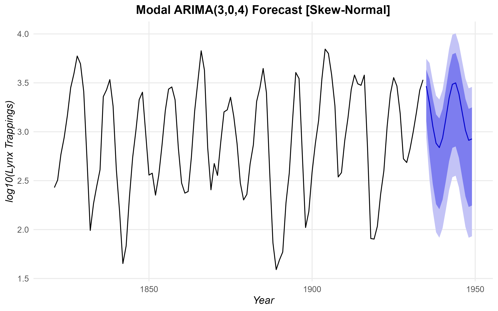
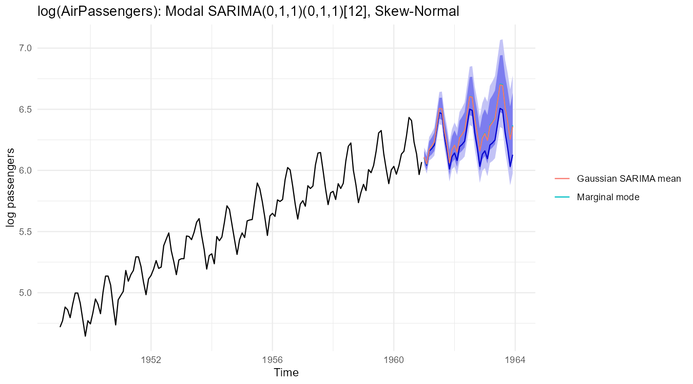

# ModalForecast

<!-- badges: start -->
[](https://CRAN.R-project.org/package=ModalForecast)
<!-- badges: end -->

The `ModalForecast` package implements parametric modal ARIMA and seasonal ARIMA (SARIMA) models utilizing the Skewed Distribution (SKD) family. Instead of connecting the expected value (mean) to covariates, the model connects the **conditional mode** to the systematic autoregressive integrated moving average components, with or without multiplicative seasonal terms.

By modeling the mode directly, this framework helps mitigate the effects of localized extremes, asymmetry, and non-normal behavior, providing robust centralized predictions under asymmetric error distributions.

## Methodology

### The Skewed Distribution (SKD) Family
To construct a modal regression model, we require a flexible parametric continuous distribution where the mode is explicitly parameterized and differentiable. We adopt the generalized SKD family, which supports robust inference through heavy tails and asymmetry. The package currently implements the **Skew-Normal**, **Skewed Student-t**, and **Skewed Laplace** distributions.

> **Note on the "normal" distribution:** In `ModalForecast`, specifying `dist = "normal"` does not invoke the standard symmetric Gaussian distribution. Instead, it refers to the **Skew-Normal** distribution from the SKD family. The standard normal is recovered asymptotically only when the estimated skewness parameter $\gamma = 1$.

Let $y_t \in \mathbb{R}$ be the response variable at time $t$. We assume $y_t$ follows a distribution from the SKD family with mode $\mu_t$, scale $\sigma$, skewness parameter $\gamma \in (0,\infty)$ (or effectively $p \in (0,1)$), and tail parameter(s) $\boldsymbol{\nu}$:

$$y_t \sim \text{SKD}(\mu_t, \sigma, \gamma, \boldsymbol{\nu})$$

The family is constructed using a scale mixture representation that ensures mathematical tractability while allowing heavy tails. A crucial property of this parameterization is that the probability density function reaches its global maximum exactly at $y_t = \mu_t$. Consequently, $\mu_t$ represents the true conditional mode of the distribution.

### Systematic Component: Modal ARIMA

Instead of the standard mean-based ARIMA, we model the sequence of conditional modes $\mu_t$:

$$ \mu_t = c + \sum_{i=1}^p \phi_i y_{t-i} + \sum_{j=1}^q \theta_j \epsilon_{t-j} $$

where $\epsilon_t = y_t - \mu_t$ is the asymmetric prediction error, $p$ is the autoregressive order, and $q$ is the moving average order. 

The parameter vector $\boldsymbol{\Theta} = (c, \boldsymbol{\phi}, \boldsymbol{\theta}, \sigma, \gamma, \boldsymbol{\nu})^\top$ is estimated via Maximum Likelihood Estimation (MLE). Conditionally on the initial values, the log-likelihood function over the sequence of $n$ observations is constructed explicitly as a function of $y_t$:

$$ \ell(\boldsymbol{\Theta}) = \sum_{t=1}^n \log f(y_t | \mu_t, \sigma, \gamma, \boldsymbol{\nu}) $$

where $f(\cdot)$ is the probability density function of the chosen SKD distribution (e.g., Skew-Normal, Skewed Student-t, Skewed Laplace), and $\mu_t$ embeds the recursive ARIMA structure.

### Seasonal Component: Modal SARIMA

For seasonal series with period $s$, let $w_t = (1-B)^d(1-B^s)^D y_t$. The Modal SARIMA$(p,d,q)	imes(P,D,Q)_s$ model is

$$\phi(B)\,\Phi(B^s)\,w_t = c + 	heta(B)\,\Theta(B^s)\,\epsilon_t, \qquad \epsilon_t \sim 	ext{SKD}(0, \sigma, \gamma, oldsymbol{
u}),$$

so the conditional mode of $w_t$ is $\mu_t = w_t - \epsilon_t$. It is fitted with the `seasonal` argument, which has the same form as in `stats::arima()`.

### Modal Forecasts: Joint Trajectory and Marginal Mode

Because the mode is not linear, `forecast()` offers two modal point forecasts. The default, `point = "joint"`, is the most probable future **trajectory**, obtained by setting future innovations to their mode, zero. `point = "marginal"` gives the most probable **value** at each horizon. Both coincide at one step ahead and for symmetric errors; with skewed errors and integrated series they can differ substantially at long horizons.
## Installation

Install the released version from CRAN:

```r
install.packages("ModalForecast")
```

or the development version from GitHub:

```r
# install.packages("devtools")
devtools::install_github("chedgala/ModalForecast")
```

## Example Application: Lynx Dataset

The following plots demonstrate the diagnostic capabilities and forecasting performance of the `ModalForecast` package using the well-known `lynx` dataset.

### Diagnostic Envelopes and Inference
The `envelope()` function constructs simulation envelopes based on the exact theoretical distance distributions of the SKD family (e.g., half-normal, half-t, exponential). This provides a visually intuitive goodness-of-fit assessment to help select the best distribution among `normal`, `t`, or `laplace`. 

Below is an evaluation of the Skew-Normal, Skewed Student-t, and Skewed Laplace fits on the `lynx` dataset:

<p align="center">
  
</p>

The `diagnostics()` function provides additional analysis including ACF/PACF of Randomized Quantile Residuals (RQR), and the `summary()` method handles analytical Fisher Information matrix standard errors.

### Out-of-Sample Forecasting
Comparison between traditional Gaussian ARIMA (Mean) and the Modal ARIMA (Mode) utilizing different members of the SKD family. The package computes both **Asymptotic** prediction intervals for standard series, and **Parametric Bootstrap** simulated prediction intervals for greater coverage in small sample settings.

<p align="center">
  
</p>

## Quick Start Tutorial

Below is a brief tutorial showing how to fit a modal ARIMA model to empirical data.

```r
library(ModalForecast)
library(forecast)

# 1. Load Empirical Data (Lynx)
data(lynx)
y <- log10(lynx) # log-transformation is common for this dataset

# 2. Find the best SKD Error Distribution (Normal vs T vs Laplace) 
# We fit a base Model and compare Information Criteria (e.g. AIC)
fit_n <- fit_modal_arima(y, order=c(2, 0, 0), dist="normal")
fit_t <- fit_modal_arima(y, order=c(2, 0, 0), dist="t")
fit_l <- fit_modal_arima(y, order=c(2, 0, 0), dist="laplace")

c(Normal = AIC(fit_n), Student = AIC(fit_t), Laplace = AIC(fit_l))

# 3. Use the rigorous Auto Modal ARIMA selector globally on the best distribution
# Since Skew-Normal returned the lowest AIC (-4.46), it wins. 
fit_auto <- auto.modal.arima(y, d=0, max.p=5, max.q=5, dist="normal")

# 4. Print the automatically fitted modal model
print(fit_auto)

# Model Summary & Diagnostics
summary(fit_auto)
diagnostics(fit_auto)

# Forecast modal trajectory with multiple confidence levels (alphas)
pred <- forecast(fit_auto, h=10, level=c(80, 95, 99))

# The package natively supports the 'forecast' library ecosystem:
library(forecast)

# 1. Plot rich visualization with confidence bands identical to standard ARIMA
autoplot(pred)

# 2. Evaluate forecast metric diagnostic functions (ME, RMSE, MAE, MAPE, etc.)
accuracy(pred)
```

### Seasonal models

```r
library(ModalForecast)
library(forecast)

# Airline model for the monthly air passengers
y <- log(AirPassengers)
fit_air <- fit_modal_arima(y, order = c(0, 1, 1),
                           seasonal = list(order = c(0, 1, 1), period = 12),
                           dist = "normal")
summary(fit_air)

# Residual diagnostics and envelopes work as for non-seasonal models
diagnostics(fit_air)
envelope(fit_air, B = 100)

# Most probable trajectory and most probable value at each horizon
fc_joint <- forecast(fit_air, h = 36)
fc_marg  <- forecast(fit_air, h = 36, point = "marginal")
autoplot(fc_joint) + autolayer(fc_marg$mean, series = "Marginal mode")

# Automatic selection, including seasonal orders
fit_auto <- auto.modal.arima(y, max.p = 2, max.q = 2, max.P = 1, max.Q = 1)
```

<p align="center">
  
</p>

The fitted object returns standard coefficients, scale `sigma`, and skewness `gamma`. If `gamma` is significantly different from 1, it indicates positive asymmetry (right-skewness if $>1$) or negative asymmetry ($<1$), capturing patterns that typical least-squares ARIMA would miss. If the specified distribution possesses additional tail parameters (like `nu` for Skewed Student-t), they are estimated automatically.

## References

* Galarza, C. E., Lachos, V. H., Cabral, C. R. B., & Castro, L. M. (2017). Robust quantile regression using a generalized class of skewed distributions. *Stat*, 6(1), 113-130. https://doi.org/10.1002/sta4.140
